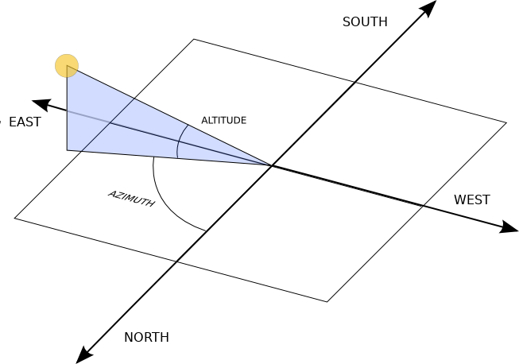
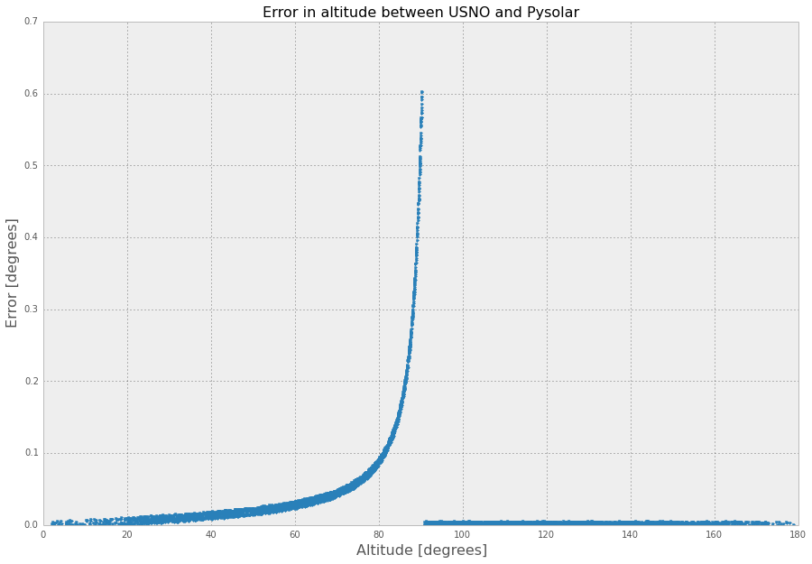
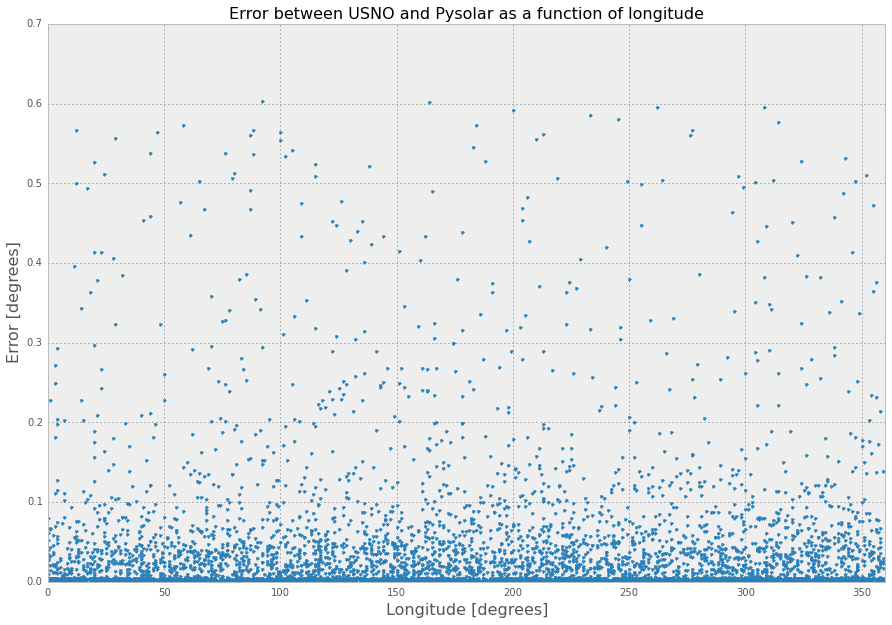
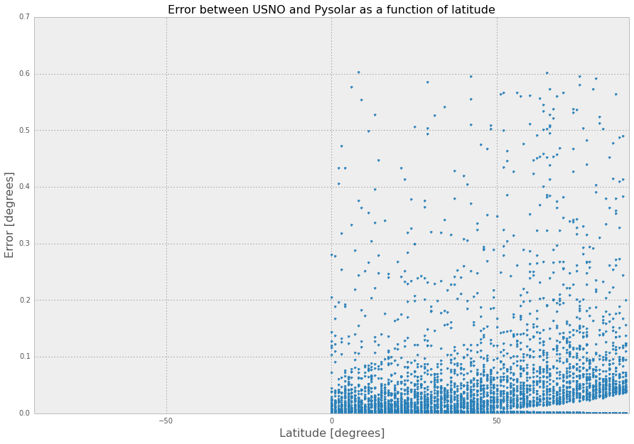

.. Pysolar documentation master file, created by
   sphinx-quickstart on Sun Dec  7 10:41:31 2014.
   You can adapt this file completely to your liking, but it should at least
   contain the root `toctree` directive.

Pysolar: staring directly at the sun since 2007
===============================================

Pysolar is a collection of Python libraries for simulating the irradiation of any point on earth by the sun. It includes code for extremely precise ephemeris calculations, and more.

Difference from PyEphem
-----------------------

Pysolar is similar to `PyEphem <http://rhodesmill.org/pyephem/>`_, with a few key differences. Both libraries compute the location of the sun based on `Bretagnon's VSOP 87 theory <http://articles.adsabs.harvard.edu/cgi-bin/nph-iarticle_query?1988A%26A...202..309B>`_. Pysolar is aimed at modeling photovoltaic systems, while PyEphem is targeted at astronomers. Pysolar is written in pure Python, while PyEphem is a Python wrapper for the libastro library, written in C, which is part of `XEphem <http://www.clearskyinstitute.com/xephem/>`_.

Difference from Sunpy
---------------------

Pysolar is similar to the sun position module in `Sunpy <http://sunpy.org>`_, which is a project focused on solar physics modeling. See, for example, their beautiful gallery of `sun image renderings <http://docs.sunpy.org/en/stable/generated/gallery/index.html>`_. The Sunpy position module is based on the same algorithm originally described by Jean Meeus, but it appears to omit the later work by Reda and Andreas at NREL that Pysolar uses, or at least the code is shorter. In any case, Sunpy is aimed at solar physics; Pysolar is aimed at modeling solar radiation on the earth.

Prerequisites for use
---------------------

Pysolar requires Python, which comes preinstalled on most Unix machines, including Apple's OS X. You can check to see if you have it installed on a Unix machine by typing python3 at a command prompt. If the result is something like::

    Python 3.4.2 (default, Oct  8 2014, 14:38:51)
    [GCC 4.9.1] on linux
    Type "help", "copyright", "credits" or "license" for more information.
    >>>

you have Python 3. (You can escape from the Python prompt with Ctrl-D.)

If the result is more like::

    bash: python3: command not found

you probably don't have Python 3.

If you need to, you can download Python from the `Python.org download page <http://python.org/download/>`_.

Examples
========

Location calculation
--------------------

You can figure out your latitude and longitude from the URL from the "Link to this page" link on Google maps. Find your location on the map, click on the "Link to this page" link, and then look at the URL in the address bar of your browser. In between ampersands, you should see something like ``ll=89.123456,-78.912345``. The first number is your latitude; the second is your longitude.

The reference frame for Pysolar is shown in the figure below.
Altitude is reckoned with zero at the horizon. The altitude
is positive when the sun is above the horizon. Azimuth is
reckoned with zero corresponding to north. Positive azimuth
estimates correspond to estimates east of north; negative
estimates, or estimates larger than 180 are west of north.
In the northern hemisphere, if we speak in terms of (altitude, azimuth),
the sun comes up around (0, 90), reaches (70, 180) around noon,
and sets around (0, 270).

Then, use the `solar.get_altitude()` function to calculate the angle between the sun and a plane tangent to the earth where you are. The result is returned in degrees.::

   from pysolar.solar import *
   import datetime
   
   latitude = 42.206
   longitude = -71.382
   
   date = datetime.datetime(2007, 2, 18, 15, 13, 1, 130320, tzinfo=datetime.timezone.utc)
   print(get_altitude(latitude, longitude, date))

Results in :

   30.91446827139096

Similarly, you could calculate the altitude of the sun right now like this.::

   latitude = YOUR_LATITUDE_GOES_HERE
   longitude = YOUR_LONGITUDE_GOES_HERE
   
   date = datetime.datetime.now(datetime.timezone.utc)
   print(get_altitude(latitude, longitude, date))

You can also calculate the azimuth of the sun, as shown below.::

   latitude = 42.206
   longitude = -71.382
   
   date = datetime.datetime(2007, 2, 18, 15, 13, 1, 130320, tzinfo=datetime.timezone.utc)
   print(get_azimuth(latitude, longitude, date))

Results in :

    149.24819184280483

Estimate of clear-sky radiation
-------------------------------

Once you calculate azimuth and altitude of the sun, you can predict the direct irradiation from the sun using Pysolar. ``get_radiation_direct()`` returns a value in watts per square meter. As of version 0.7, the function is *not* smart enough to return zeros at night. It does account for the scattering of light by the atmosphere, though it uses an atmospheric model based on data taken in the United States.::

   latitude_deg = 42.206 # positive in the northern hemisphere
   longitude_deg = -71.382 # negative reckoning west from prime meridian in Greenwich, England
   date = datetime.datetime(2007, 2, 18, 15, 13, 1, 130320, tzinfo=datetime.timezone.utc)
   altitude_deg = get_altitude(latitude_deg, longitude_deg, date)
   radiation.get_radiation_direct(date, altitude_deg)

Results in

   909.582292149944

Troubleshooting
===============

If you find yourself getting errors like `AttributeError: 'datetime.datetime' object has no attribute 'timestamp'`, this probably means that you are using Python 2 instead of Python 3.

Pysolar no longer supports Python 2. If you're stuck on Python 2
because of some other dependency, you should use Pysolar 0.6,
which is the last version that works with Python 2.

Note that there have been major changes in naming between versions.
In version 7 the function names were changed from CamelCase to
lower case with underscores.  For example, `GetAzimuth` became
`get_azimuth`.  In version 8, the package name lost its upper-case
first letter, so `from Pysolar import solar` became
`from pysolar import solar`.

Validation
==========

Pysolar has been validated against similar ephemeris code maintained by the United States Naval Observatory (USNO). In a random sampling of 6000 locations distributed across the northern hemisphere at random times in 2008, Pysolar matched the observatory's predictions very accurately. The azimuth estimations correlated much more closely than the altitude estimations, but both agreed with the naval observatory's to within less than 0.1 degrees on average.

Using the script included in Pysolar called ``query_usno.py``, around 6200 datapoints were gathered from the website of the US Naval Observatory. The datapoints were randomly distributed in time and space, with the following restrictions:

* Times were limited to 2008 and, to match the USNO's resolution, rounded to the nearest second.
* Locations were limited to integral degrees of latitude and longitude in the northern hemisphere to match USNO's resolution. (In theory, the USNO script should accept locations in the southern hemisphere; in practice, negative latitudes caused the script to fail.)
* Elevation was limited to sea level to make the search space smaller.

Error statistics
----------------

The statistics below are generated by ``query_usno.py`` when run on the data file ``usno_data_6259.txt``, as in::

    python3 -i query_usno.py usno_data_6259.txt

Azimuth error
-------------

* Mean error: 0.00463 degrees
* Standard deviation of error: 0.00550 degrees
* Minimum error: 6.10 x 10e-6 degrees
* Maximum error: 0.176 degrees

Altitude error
--------------

* Mean error: 0.0379 degrees
* Standard deviation: 0.0795 degrees
* Minimum error: 1.04 x 10e-6 degrees
* Maximum error: 0.604 degrees

Validation data
---------------

The full validation data files are included in Pysolar. See the files: ``usno_data_6259.txt`` and ``pysolar_v_usno.csv``.

Click on charts for larger versions.

Validation procedure
--------------------

You can check the accuracy of Pysolar yourself using the iPython Notebook file ``test/validation.ipynb``. The validation steps are:

1. Install `IPython Notebook <http://ipython.org/install.html>`_, plus a few Python dependencies.

``sudo apt-get install ipython3-notebook python3 python3-matplotlib python3-pandas python3-scipy python3-tz``

2. Make sure you have installed only the version of Pysolar that you want to validate.

3. Change to the test directory: `cd pysolar/test/`

4. Run ``python3 -i query_usno.py usno_data_6259.txt``. This runs Pysolar's ``get_altitude()`` and ``get_azimuth()`` functions repeatedly, compares the results to a file included in Pysolar of data pulled from the USNO website, and writes the results to the file ``test/pysolar_v_usno.csv``.

5. Start IPython Notebook and open ``validation.ipynb``.

6. Run the code in ``test/validation.ipynb``, which will calculate the error statistics and generate the graphs shown above.

References
==========

`Abstract <http://www.osti.gov/bridge/product.biblio.jsp?query_id=1&amp;page=0&amp;osti_id=15003974>`_ `1.1 MB PDF <http://www.osti.gov/bridge/servlets/purl/15003974-iP3z6k/native/15003974.PDF>`_ I. Reda and A. Andreas, "Solar Position Algorithm for Solar Radiation Applications," National Renewable Energy Laboratory, NREL/TP-560-34302, revised November 2005.

`Online book <http://onlinelibrary.wiley.com/book/10.1002/0471668826>`_ G. Masters, "Renewable and Efficient Electric Power Systems," Wiley-IEEE Press, 2004.

`Abstract <http://pubs.giss.nasa.gov/abs/bi03000u.html>`_ `4.6 MB PDF <http://pubs.giss.nasa.gov/docs/1997/1997_Bishop_etal_1.pdf>`_ J. K. B.
Bishop, W. B. Rossow, and E. G. Dutton, "Surface solar irradiance from the International Satellite Cloud Climatology Project 1983-1991," Journal of Geophysical Research, vol. 102, no. D6, March 27, 1997, pp. 6883-6910.

Source Code Repository
======================

Pysolar was initially hosted on Sourceforge with Subversion,
but we switched to git and Github in 2008:
`https://github.com/pingswept/pysolar <https://github.com/pingswept/pysolar>`_

Contributors
============

Many people have contributed to Pysolar since its inception.

Thanks to Holger Zebner, Pietro Zambelli, Sean Taylor, Simeon Obinna Nwaogaidu, Tim Michelsen, Jon Little, and Lahmeyer International for their contributions of code, bugfixes, documentation, and general encouragement.

Pysolar has been used at several universities, including the University of Oldenburg in Germany, the University of Trento in Italy, and the University of Texas at Austin. It is also deployed in at least one commercial solar tracking system.

.. toctree::
   :maxdepth: 2

